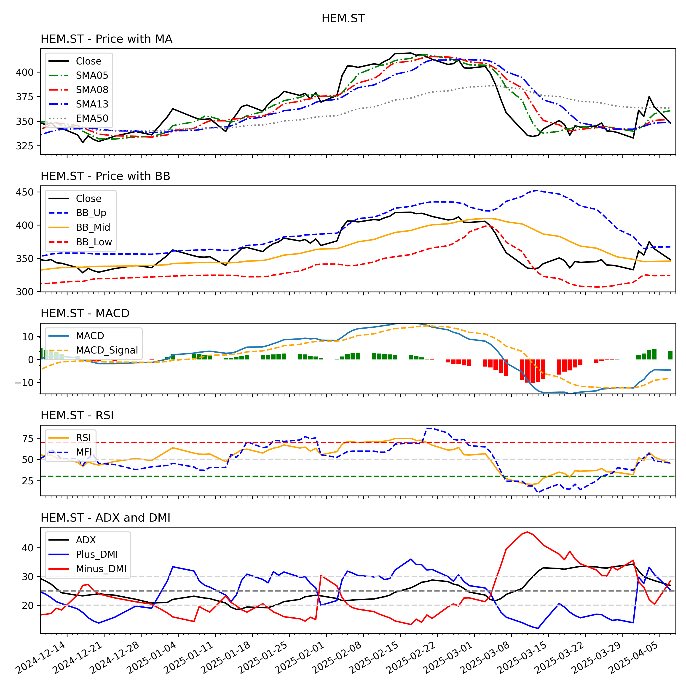
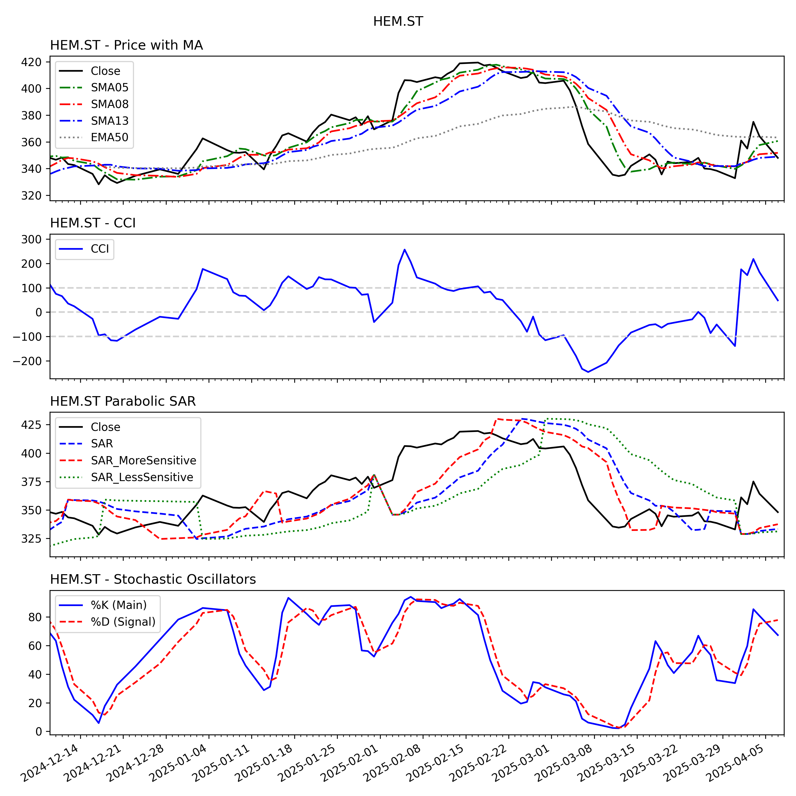
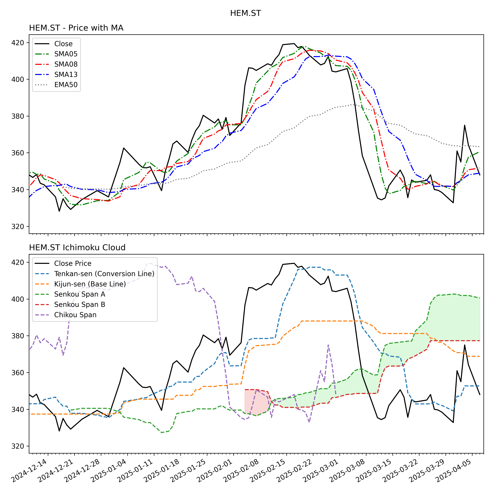
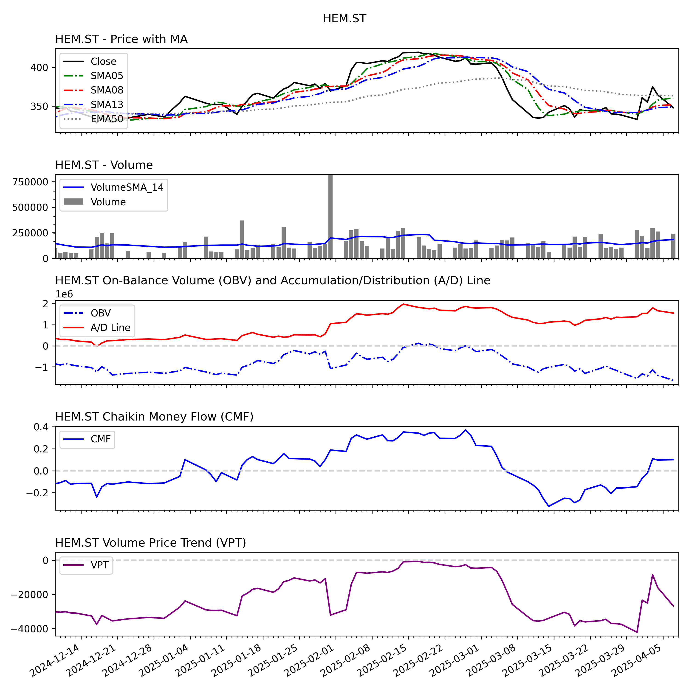

# Stock Market Data Analysis - Technical Analysis - Python

This repository contains a Python-based analysis tool to download, analyze, and visualize stock data from the Swedish stock exchange (OMX Stockholm). It uses various technical indicators and produces financial visualizations and plots.

---

## Features

- Automatic data download using `yfinance`
- Calculation of 30+ technical indicators using `TA-Lib`
- Multiple plotting sets to visualize moving averages, RSI, MACD, Bollinger Bands, Ichimoku Cloud, and more
- Candlestick charting with pattern detection (e.g., Hammer, Doji, Engulfing)
- Automatic saving of plots and CSV exports for further analysis

---

## Dependencies

The following libraries are required:

```bash
pandas
numpy
matplotlib
yfinance
talib
mplfinance
```

Install them with:

```bash
pip install -r requirements.txt
```

---

## Folder Structure

```
Stock_Market/
├── data/
│   └── selected/
│       ├── plots_YYYY-MM-DD/
│       │   └── [PNG plots for each stock]
│       └── stock_data_combined_YYYY-MM-DD.csv
├── StockMarket_DataAnalysis.py
├── requirements.txt
└── README.md
```

> Ensure the folder `data/selected` exists or is auto-created when you run the script.

---

## Getting a List of Valid Tickers

To run this script, you need valid ticker symbols from the stock markets.

### Options to Get Ticker Symbols:

1. **Use Yahoo Finance**  
   Go to [https://finance.yahoo.com/lookup](https://finance.yahoo.com/lookup), select country as **Sweden**, and note down ticker symbols ending with `.ST` (e.g., `HEM.ST`, `INDT.ST`, `VOLV-B.ST`).

2. **OMX Stockholm Indexes**  
   Commonly tracked indices:
   - OMXS30: Top 30 companies (e.g., `ABB.ST`, `ERIC-B.ST`, `VOLV-B.ST`)
   - Mid & small caps: Available on [Nasdaq Nordic Market](https://www.nasdaqomxnordic.com/shares)

---

## Example Plots

Below are example plots generated on 2025-04-08 (from `selected/plots_2025-04-08`):

**1. Price and Moving Averages**



**2. RSI and MACD**



**3. Ichimoku Cloud**



**4. Volume and OBV**



---

## How to Use

1. Clone the repository:

```bash
git clone https://github.com/sanjiv856/stock-market-technical-analysis.git
cd stock-market-technical-analysis
```

2. Install dependencies:

```bash
pip install -r requirements.txt
```

3. Run the script:

```bash
StockMarket_DataAnalysis.py
```

The script will:
- Download 180 days (changes as per the requirement in the script) of historical daily data for selected Swedish tickers
- Calculate technical indicators
- Generate and save 6 sets of plots per ticker
- Export a combined CSV dataset

---

## Tickers Used (Sample)

```python
tickers_sweden = ['HEM.ST', 'INDT.ST', 'BERG-B.ST']
```
You can update this list inside the script with your own selection of OMX Stockholm tickers.

---

## Technical Indicators Used

### Trend:
- SMA, EMA
- Bollinger Bands
- Ichimoku Cloud
- Parabolic SAR

### Momentum:
- RSI, MACD
- Stochastic, CCI, CMO
- ROC, TRIX, ULTOSC, WILLR

### Volume:
- OBV, AD Line
- Chaikin Money Flow (CMF)
- Volume Price Trend (VPT)
- Volume SMA

### Volatility:
- ATR, NATR, TRANGE

### Candlestick Patterns:
- Hammer, Doji, Engulfing, Morning/Evening Star, Shooting Star

---

## Disclaimer

This project is intended for educational and exploratory purposes only.  
It is not investment advice. Stock market trading involves risk.  
Please use your own judgment and consult a financial advisor before making investment decisions.

---

## Contact

For queries, suggestions, or bug reports, feel free to open an issue or contact [drsanjivk@gmail.com].

---

## License

This project is open-source and available under the MIT License.
